# AI Agent Backend

AI Agent 后端 - 文档检索助手

## 项目概述

基于 AI Agent 架构的文档检索助手，通过技能系统和多层检索架构，提供智能对话、技能调用和信息检索服务。

## 核心能力

| 能力 | 描述 |
|------|------|
| **智能对话** | 基于用户画像和历史上下文的个性化对话 |
| **技能调用** | AI 按需加载技能，渐进式披露专业能力 |
| **文档检索** | 三层混合检索（向量 + 关键词 + Rerank） |
| **参考读取** | 按需读取技能参考资料 |
| **长期记忆** | 用户画像浓缩，跨会话记忆保持 |
| **SSE 流式** | Server-Sent Events 实时流式输出 |

---

## 架构设计

### 系统架构总览

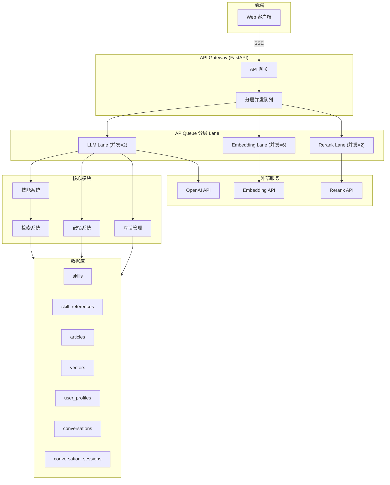

### 核心设计理念

| 理念 | 描述 |
|------|------|
| **渐进式披露** | AI 按需加载 Skill，避免上下文污染 |
| **分层并发** | 所有外部请求通过 APIQueue 分 lane Semaphore 控制 |
| **Skill 数据库化** | Skill 定义存数据库，支持动态管理 |
| **记忆浓缩** | 短期对话 + 用户画像 → AI 浓缩 → 更新画像 |

### 依赖注入入口

- CLI 同步入口使用 `src.di.providers.get_chat_client()`
- API SSE 服务使用 `src.di.providers.get_chat_service()`
- 异步聊天客户端创建使用 `src.di.providers.create_chat_client()`
- `ChatClient` 内部继续通过 `get_skill_system()`、`get_memory_manager()`、`get_history_manager()` 收口依赖

---

## 核心模块

### 渐进式披露机制

AI 在初始化时只知道 Skill 的列表，不包含具体内容。当 AI 判断需要使用某个 Skill 时，才动态加载该 Skill 的 SKILL.md 和二级工具。

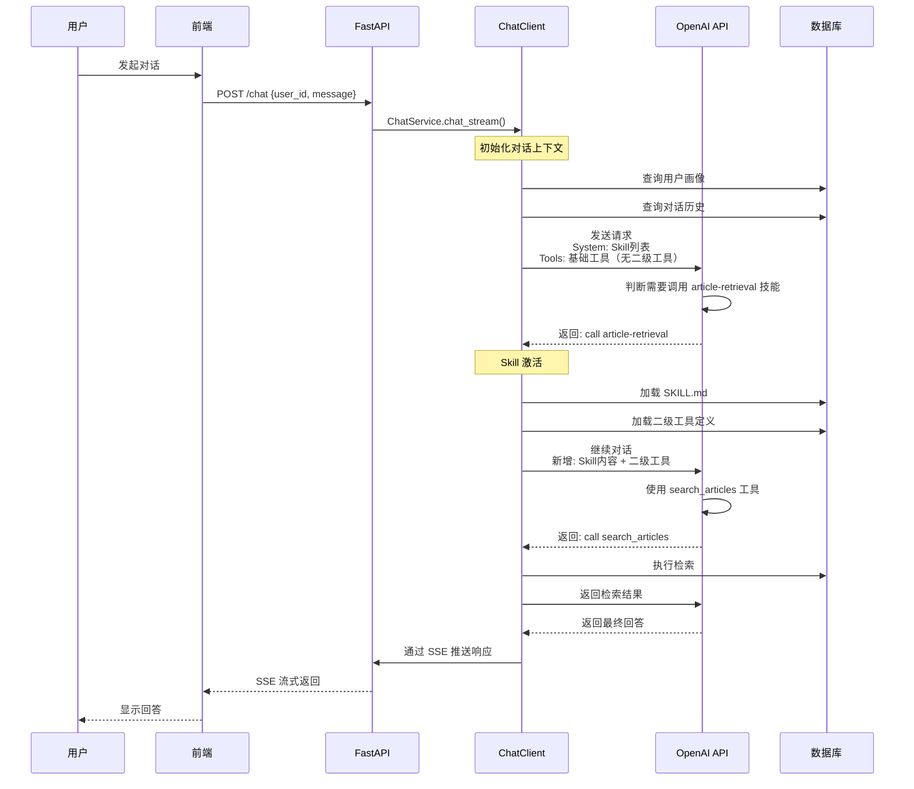

### 技能系统

| 组件 | 描述 | 状态 |
|------|------|------|
| **Skill 加载 (文件系统)** | 从 skills/ 目录加载 Skill 定义 | ✅ 已实现（已废弃） |
| **Skill 加载 (数据库)** | 从数据库加载 Skill 定义 | ✅ 已实现（推荐） |
| **二级工具** | Skill 专属工具，激活后可用 | ✅ 已实现 |
| **read_reference** | AI 按需读取 Skill 参考资料 | ✅ 已实现 |
| **数据库化** | Skill 存数据库而非文件系统 | ✅ 已实现 |

### 检索系统

基于 Skill 的二级工具机制，提供多种检索能力：

| 工具 | 描述 | 状态 |
|------|------|------|
| `search_articles` | 向量搜索相关文章 | ✅ 已实现 |
| `grep_article` | 获取指定文章内容，支持多种搜索模式 | ✅ 已实现 |
| `grep_articles` | 跨多个文章搜索 | ✅ 已实现 |

#### grep_article 多模式搜索

`grep_article` 工具内部采用三层混合检索策略：

```
Layer 1: EBD 向量搜索 (top-20)
    ↓
Layer 2: 关键词模糊搜索 (top-20)
    ↓
Layer 3: Rerank 重排序 (top-k)
```

支持的搜索模式：`auto` / `summary` / `keyword` / `regex` / `section` / `line_range`

## 检索功能

### 通用文档检索
- 三层混合检索策略（向量 + 关键词 + Rerank）
- 支持多模式内容定位（summary/keyword/regex/section/line_range）

### 记忆系统

```
┌─────────────────────────────────────────────────────────────┐
│                        记忆系统                              │
├─────────────────────────────────────────────────────────────┤
│                                                             │
│  短期记忆                           长期记忆                 │
│  ┌─────────────────┐               ┌─────────────────┐     │
│  │ 对话历史        │  浓缩更新     │   用户画像       │     │
│  │ - 消息内容      │  ──────────►  │   - portrait_text│     │
│  │ - 对话评分      │    (AI API)   │   - knowledge_text│    │
│  │ - 时间戳        │               │   - preferences  │     │
│  └─────────────────┘               └─────────────────┘     │
│         ▲                                  │               │
│         │                                  ▼               │
│  ┌─────────────────┐               ┌─────────────────┐     │
│  │ 每条对话        │               │ 对话初始化时     │     │
│  │ 打分存储        │               │ 加载画像上下文   │     │
│  └─────────────────┘               └─────────────────┘     │
│                                                             │
└─────────────────────────────────────────────────────────────┘
```

### 分层并发队列 (APIQueue)

APIQueue 采用 asyncio.Semaphore 分 lane 控制并发：

| Lane | 并发数 | 用途 |
|------|--------|------|
| `llm` | 2 | 对话请求、AI 调用 |
| `embedding` | 6 | 向量生成 |
| `rerank` | 2 | 检索重排序 |

---

## 数据库设计

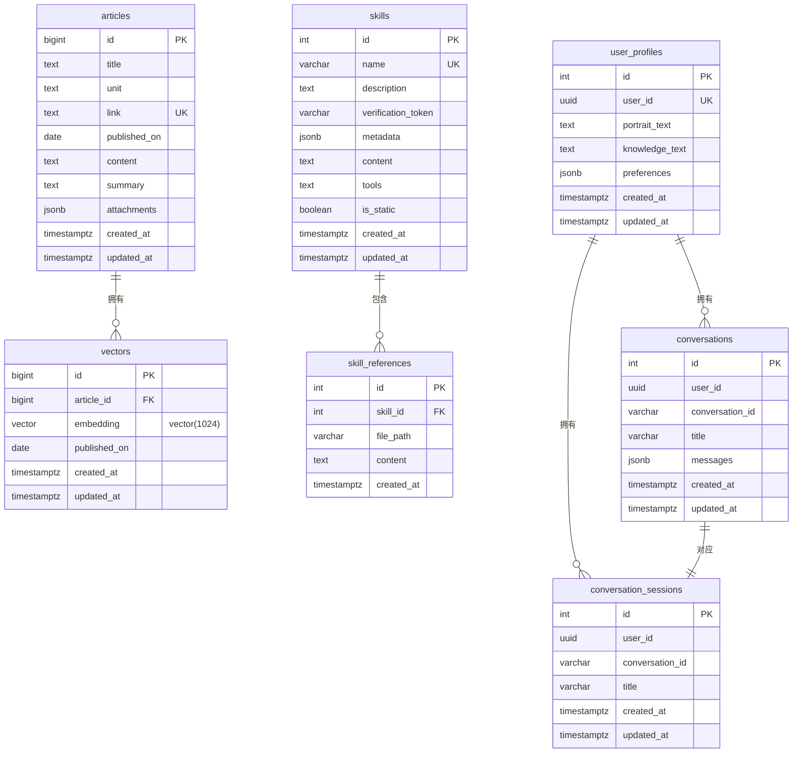

| 表名 | 用途 | 更新方式 |
|------|------|---------|
| `articles` | OA 文章元数据和内容 | crawler 爬取导入 |
| `vectors` | 文章向量嵌入 | crawler 生成导入 |
| `skills` | 技能定义 | 指导型: migration 初始化<br/>可更新型: CRUD 接口 |
| `skill_references` | 技能参考资料 | 与 skills 同步 |
| `user_profiles` | 用户画像（长期记忆） | AI 浓缩自动更新 |
| `conversations` | 对话记录（短期记忆） | 自动创建，JSONB 存储 |
| `conversation_sessions` | 会话元信息 | 自动创建 |

---

## 部署架构

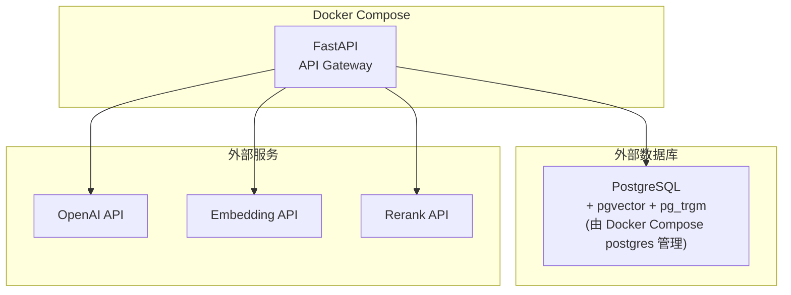

> 注意：PostgreSQL 数据库由 Docker Compose 中的 postgres 容器管理，AI End 通过 `.env` 配置连接。

| 服务 | 技术栈 | 职责 |
|------|--------|------|
| **API Gateway** | FastAPI + Uvicorn | 接收请求、SSE 推送、分层并发控制 |
| **PostgreSQL** | PostgreSQL + pgvector + pg_trgm | 持久化存储、向量搜索 |

---

## 技术栈

| 类别 | 技术 |
|------|------|
| 语言 | Python 3.11+ |
| 框架 | FastAPI + Uvicorn |
| 数据库 | PostgreSQL + pgvector + pg_trgm + asyncpg |
| 并发 | asyncio.Semaphore (APIQueue) |
| 部署 | Docker + Docker Compose |
| LLM | OpenAI API (Function Calling) |
| Embedding | BAAI/bge-m3 |
| Rerank | BAAI/bge-reranker-v2-m3 |

---

## 架构细节

以下组件架构图详细展示系统内部关键实现细节。

### 1. 异步队列与并发治理

APIQueue 采用**分层 lane** 机制，按 API 类型独立控制并发：

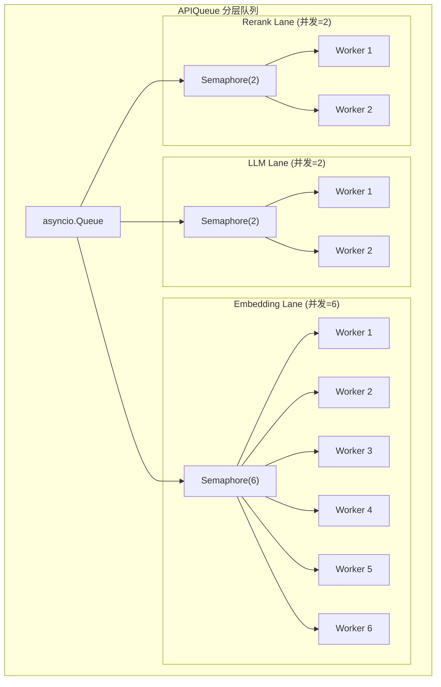

| Lane | 并发数 | 用途 |
|------|--------|------|
| `llm` | 2 | 对话请求、AI 调用 |
| `embedding` | 6 | 向量生成 |
| `rerank` | 2 | 检索重排序 |

---

### 2. 后台工具调用事件循环

工具调用通过**独立后台线程**的事件循环执行：

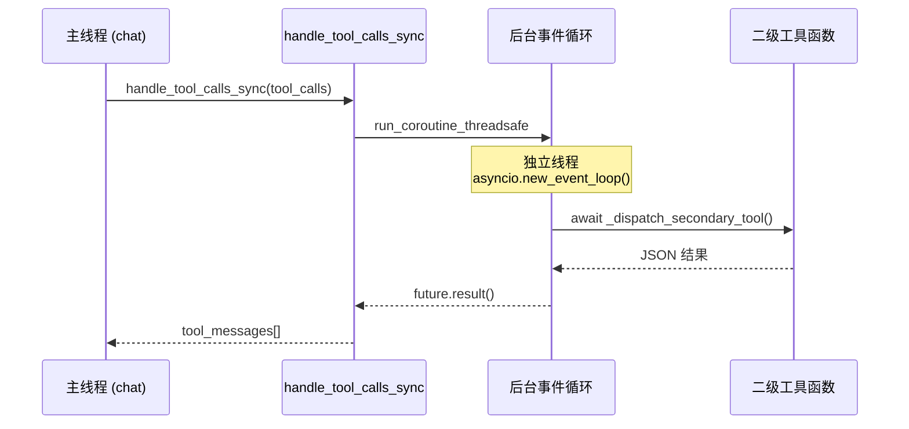

**关键特性**：
- 主线程同步，后台线程异步执行
- `run_coroutine_threadsafe` 跨线程调度
- 生命周期：`_get_tool_loop()` 创建 → `shutdown_tool_loop()` 关闭

---

### 3. grep_article 多模式搜索流程

`grep_article` 内部采用**策略模式**匹配不同搜索模式：

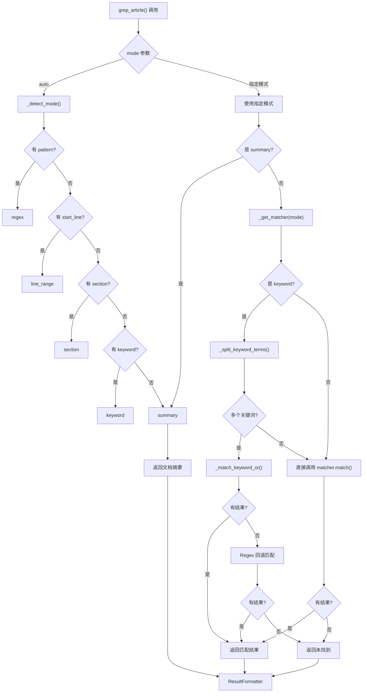

---

### 4. 文章检索器继承体系

所有文章检索能力由 `ArticleRetriever` 实现，继承自 `BaseRetriever` 基类：

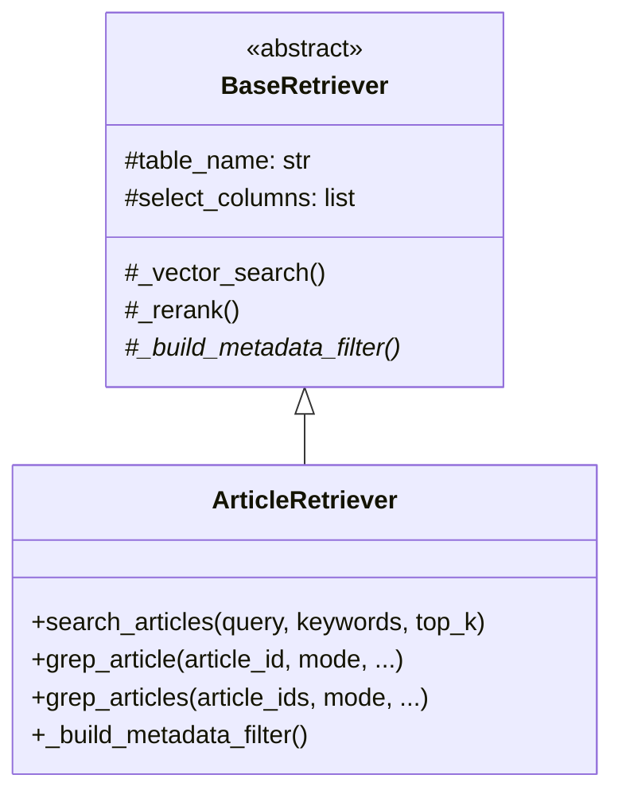

| 检索器 | 表名 | 特点 |
|--------|------|------|
| `ArticleRetriever` | `articles` | 三层混合检索（向量+关键词+Rerank）+ 多模式内容定位 |

---

### 5. 通用内容处理工具 (document_content)

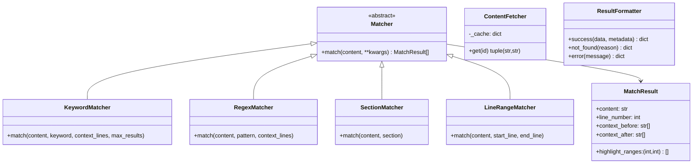

**使用状态**：

| 功能 | 使用工具 |
|------|----------|
| `grep_article` | 复用 Matcher 策略 |
| `search_articles` | 统一文章检索入口 |

---

### 6. 技能系统两级工具机制

AI 按需激活技能，动态加载二级工具：

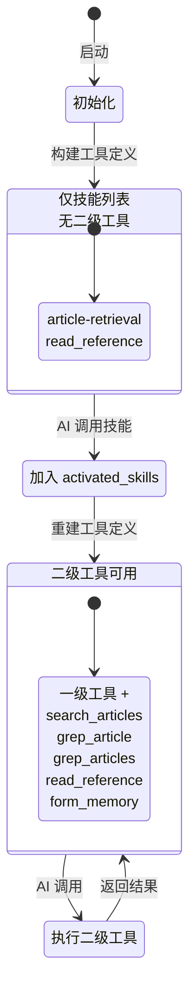

---

### 7. 主程序流程

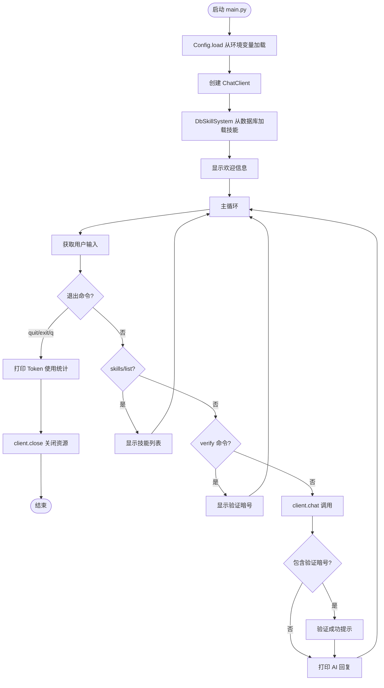

**命令类型**：
- `quit/exit/q` - 退出程序
- `skills/list` - 查看技能列表
- `verify <skill_name>` - 显示验证暗号
- 其他 - 与 AI 对话

---

### 8. 数据导入脚本流程

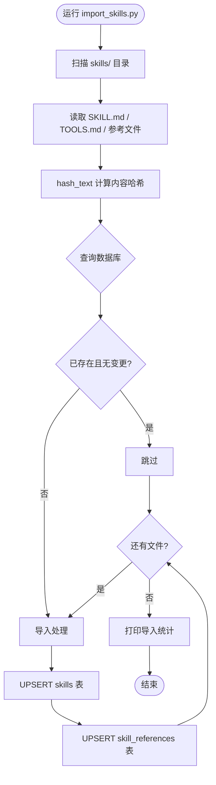

**支持的导入脚本**：
- `scripts/import_skills.py` — 技能定义导入（SKILL.md, TOOLS.md, 参考文件）

---

## 架构演进

| 方面 | 旧版本 (Flask) | 当前版本 (FastAPI + 技能系统) |
|------|----------------|----------------|
| **框架** | Flask + LangGraph | FastAPI + 技能系统 |
| **交互方式** | JSON API | SSE 流式 + JSON 兼容 |
| **Skill 存储** | 文件系统 | 数据库 (DbSkillSystem) |
| **并发处理** | 同步队列 | asyncio.Semaphore 分 lane |
| **用户管理** | 无 | 用户系统 + 画像 + 会话 |
| **记忆管理** | Redis 缓存 | PostgreSQL 短期 + 长期记忆 |
| **部署方式** | 本地运行 | Docker 容器化 |
